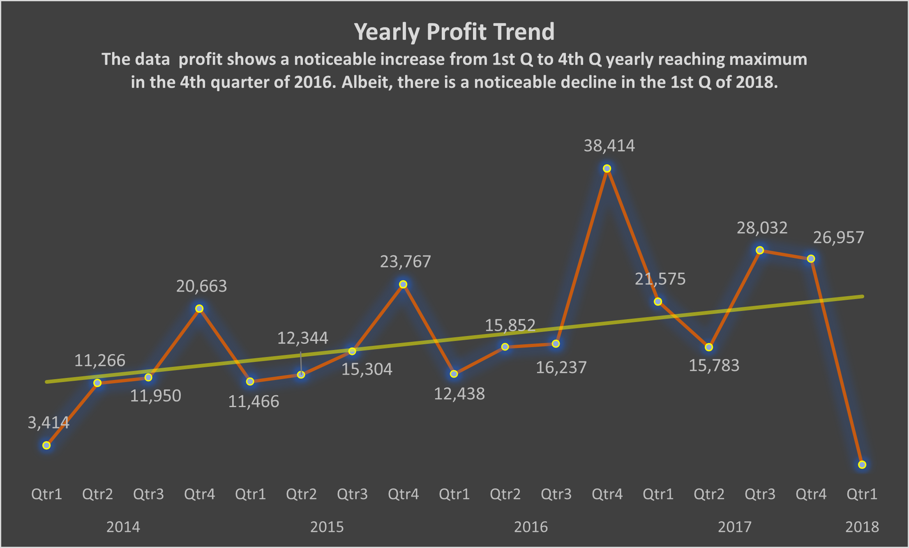
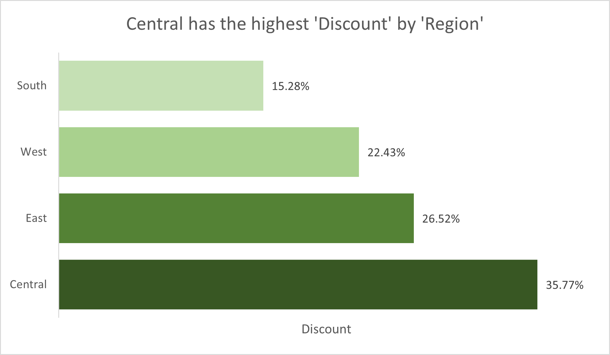
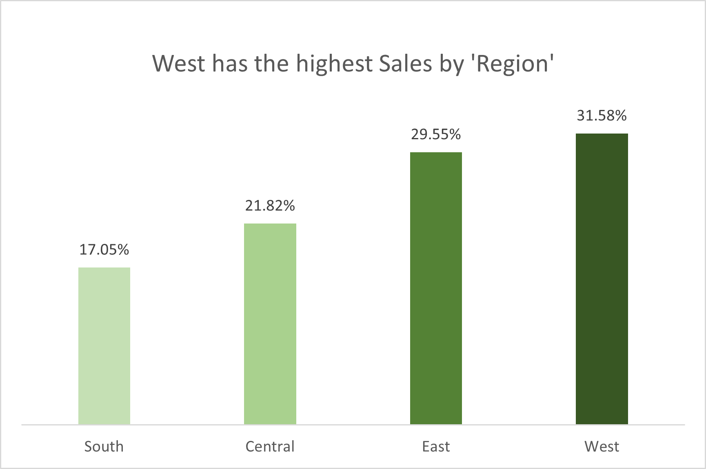
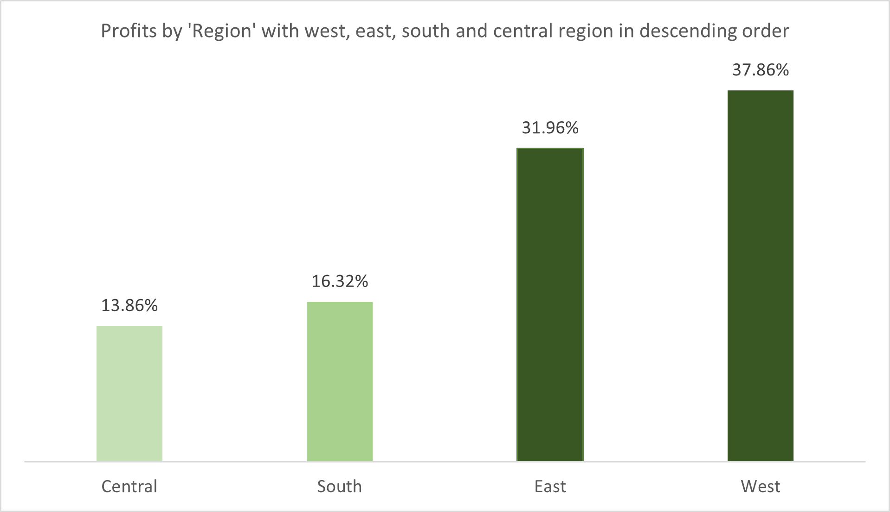
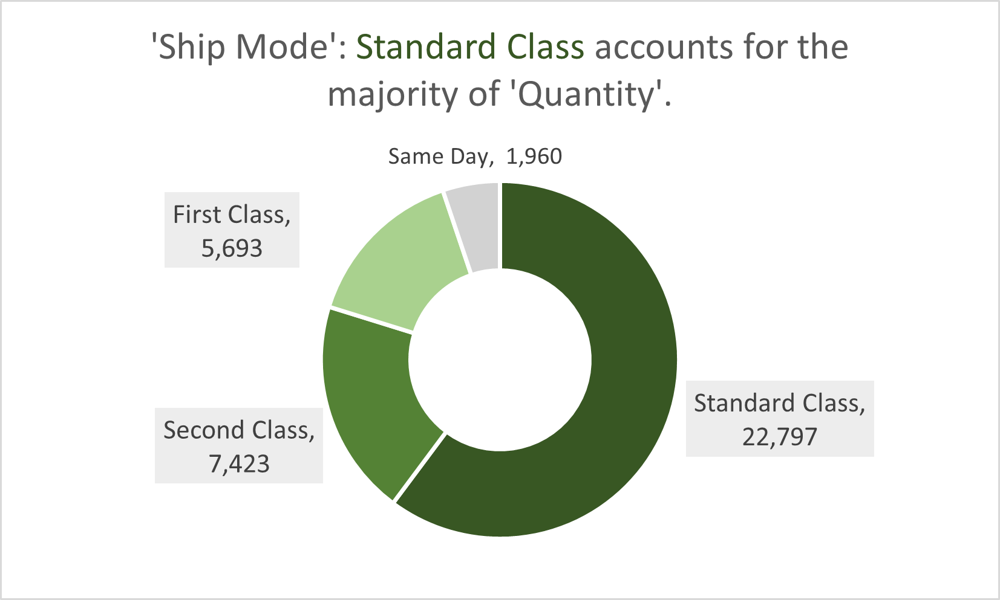
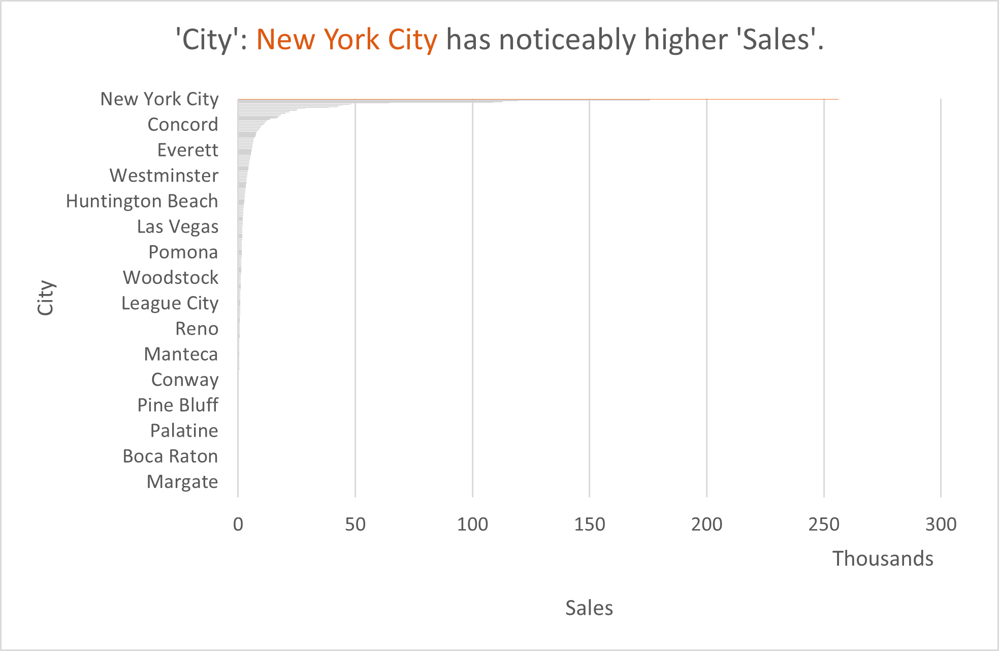

# US-STORE-ANALYSIS

# INTRODUCTION
Every day, the global shipping industry faces the complex task of delivering products to diverse regions, often encountering a myriad of logistical challenges. In this report, we delve into the operations of 'XYZ' Company, a leading shipping company that prides itself on its commitment to timely and reliable deliveries. Our objective is to uncover insights from the wealth of data at our disposal, with the aim of enhancing the company's performance, optimizing costs, and ensuring customer satisfaction.
The task is to point at four (4) Key Performance Index (KPI’s) that tends to answer six business questions and also creating Pivot Tables displaying the following:
Every day, the global shipping industry faces the complex task of delivering products to diverse regions, often encountering a myriad of logistical challenges. In this report, we delve into the operations of 'XYZ' Company, a leading shipping company that prides itself on its commitment to timely and reliable deliveries. Our objective is to uncover insights from the wealth of data at our disposal, with the aim of enhancing the company's performance, optimizing costs, and ensuring customer satisfaction.
The task is to point at four (4) Key Performance Indexes (KPIs) that tends to answer six business questions and also creating Pivot Tables displaying the following:
1.	Sales Revenue: Total revenue,total sales and total profit, over a specific period of time.
2.	Profit Margin: Profit margin, how is our profit trending and factors influencing it.
3.	Order Fulfillment Time: Average time from order placement to shipment, checking efficiency of the fulfillment process and also delays. Minimum and maximum number of shipping duration, average shipping duration and customers preferred shipping mode.
4.	Sales by Region: Sales revenue by geographical region, regions with the strongest market and performance and factors contributing to the differences by region.
5.	Visualize the insights gotten from the Pivot Table
## PROBLEM STATEMENT
The primary goals of this analysis are twofold: first, to scrutinize the company's key performance indicators and second, to address various business inquiries associated with these metrics. Through this analysis, we aim to unearth vital insights concerning the company's strengths and areas of improvement, with a particular focus on total sales revenue, profit margins, order fulfillment timeframes, regions, and product categories that significantly influence market dynamics. These revelations will provide the company with invaluable data, enabling them to enhance their weak points while maintaining strong customer relationships.
## Skills and Concept
The analysis had demonstrated a range of essential data analysis skills, such as:
- Data extraction
-	Data Cleaning and Transformation
-	Statistical measures and conditional logic to make data-driven decisions.
-	Excel functions
-	Pivot Table Creation and Analysis
-	Data Visualization

  ## VISUALIZATIONS
### The yearly trend on a quaterly basis of sales made of all products. 

-------------------------------------------------------------------------------------------

## Standard shipping seems to be the most sort after shipping mode by customers averagely.

-----------------------------------------------------------------------------------------

----------------------------------------------------------------------------------------------------
## The discounts, sales and profit by region

**Discounts**          |        **Sales by Region**                    |                      **Profit by Region**
:----------------------:|:----------------------------------------:|:------------------------------------
    |                      |
---------------------------------------------------------------------------------------------------------

----------------------------------------------------------------------------------
## Shipping mode by quantity and the city that made the highest sales
**Shipping Mode by Quantity**          |        **Sales by City**                                   
:----------------------:|:----------------------------------------
    |                      
---------------------------------------------------------------------------------------------------------

# CONCLUSION AND RECOMMENDATION
1.	Total sales revenue is 2,297,200.88 and this revenue increases yearly from 2014-2016. The revenue declined in 2017 and 2018 from what was observed in the peak of 2016.
2.	A 12.5% profit margin can be deemed outstanding for one company and unsatisfactory for another. Hence, it's crucial to assess this margin within its specific context. The profit, as indicated by the trendline, displays a gradual and fluctuating increase over the years. The most prominent surge occurs from the 1st quarter to the 4th quarter annually. The pinnacle of profitability was attained in the 4th quarter of 2016, followed by a sharp decline in the 1st quarter of the subsequent year, with a subsequent gradual recovery until the 1st quarter of 2018. Understanding the market dynamics and factors driving this observable trend is imperative, particularly in the context of the 4th quarter, which is influenced by seasonal demands, holiday sales, and inventory management. Companies frequently establish yearly performance targets, with the 4th quarter serving as the final opportunity to meet these objectives, thereby motivating endeavors to enhance profits in the concluding quarter.
3.	The mean shipping duration was calculated to be 4 days, with the shortest and longest shipping durations being 1 and 7 days, respectively. This information provides insights into potential shipping delays that can occur when transporting goods. Notably, customer behavior plays a pivotal role in the order fulfillment process. It was observed that a significant number of customers favor the standard shipping mode, increasing the likelihood of goods being delivered within the average timeframe, with the majority arriving between 5 and 7 days. Factors like delivery cost may explain the prevalence of this delivery choice. While the order fulfillment process is efficient, it's important to recognize that achieving even higher efficiency may entail additional costs.
4.	The Western region recorded the highest sales, accounting for 31.58% of total sales. This prompts questions about why the region with the most substantial discounts ended up with the lowest profit. The company faces a decision point: should it consider offering the region with the highest sales and profits even greater discounts to further boost customer loyalty and patronage?

